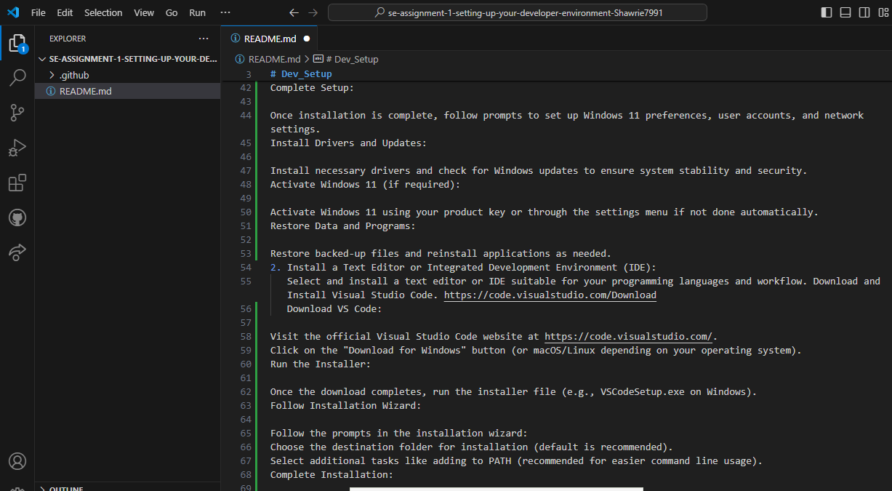
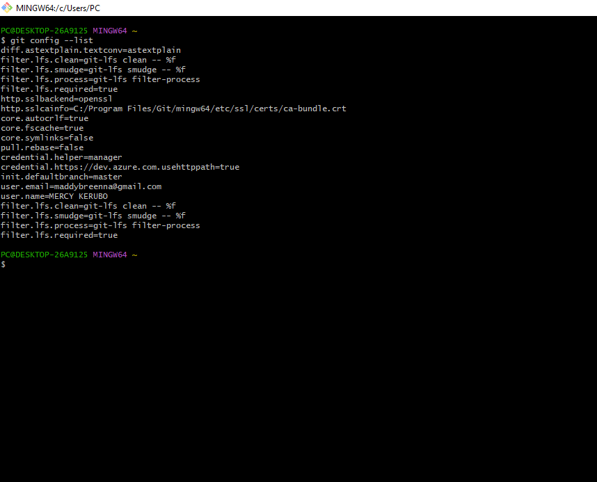

# Dev_Setup
Setup Development Environment

#Assignment: Setting Up Your Developer Environment

#Objective:
This assignment aims to familiarize you with the tools and configurations necessary to set up an efficient developer environment for software engineering projects. Completing this assignment will give you the skills required to set up a robust and productive workspace conducive to coding, debugging, version control, and collaboration.

#Tasks:

1. Select Your Operating System (OS):
   Choose an operating system that best suits your preferences and project requirements. Download and Install Windows 11. https://www.microsoft.com/software-download/windows11
Download Windows 11:

Visit Microsoft's official website and download the Windows 11 installation media or ISO file using the Media Creation Tool.
Create Installation Media:

Use the Media Creation Tool to create a bootable USB drive with the Windows 11 installation files.
Check System Requirements:

Ensure your PC meets the minimum requirements for Windows 11, including CPU, RAM, storage, and TPM 2.0.
Backup Your Data:

Back up all important files and data to an external drive or cloud storage.
Boot from Installation Media:

Restart your PC and access BIOS/UEFI settings to set the boot order to prioritize the USB drive or DVD.
Start Installation:

Boot from the installation media and follow on-screen instructions to begin installing Windows 11.
Enter Product Key (if needed):

Input your Windows 11 product key if prompted during installation. Skip if upgrading from Windows 10 or if pre-installed.
Choose Installation Type:

Select "Custom: Install Windows only" for a clean installation or "Upgrade" if coming from Windows 10.
Partition and Install:

Select the drive to install Windows 11, create partitions if necessary, and proceed with the installation.
Complete Setup:

Once installation is complete, follow prompts to set up Windows 11 preferences, user accounts, and network settings.
Install Drivers and Updates:

Install necessary drivers and check for Windows updates to ensure system stability and security.
Activate Windows 11 (if required):

Activate Windows 11 using your product key or through the settings menu if not done automatically.
Restore Data and Programs:

Restore backed-up files and reinstall applications as needed.
2. Install a Text Editor or Integrated Development Environment (IDE):
   Select and install a text editor or IDE suitable for your programming languages and workflow. Download and Install Visual Studio Code. https://code.visualstudio.com/Download
   Download VS Code:

Visit the official Visual Studio Code website at https://code.visualstudio.com/.
Click on the "Download for Windows" button (or macOS/Linux depending on your operating system).
Run the Installer:

Once the download completes, run the installer file (e.g., VSCodeSetup.exe on Windows).
Follow Installation Wizard:

Follow the prompts in the installation wizard:
Choose the destination folder for installation (default is recommended).
Select additional tasks like adding to PATH (recommended for easier command line usage).
Complete Installation:

Wait for the installation process to complete.
Open VS Code:

Once installed, launch VS Code from the desktop shortcut or Start Menu (on Windows) or Applications folder (on macOS).
Install Extensions (optional):

Customize VS Code by installing extensions for languages, themes, and other functionalities from the Extensions Marketplace (accessible through the Extensions view in VS Code).

3. Set Up Version Control System:
   Install Git and configure it on your local machine. Create a GitHub account for hosting your repositories. Initialize a Git repository for your project and make your first commit. https://github.com
 Install Git
On Windows:

Download Git from the official website: git-scm.com.
Run the installer and follow the prompts, keeping the default settings unless specific customization is needed.
On macOS:

Open Terminal.
Install Git using Homebrew:
sh
Copy code
brew install git
On Linux:

Open Terminal.
Install Git using the package manager:
sh
Copy code
sudo apt-get install git
or for Fedora:
sh
Copy code
sudo dnf install git
2. Configure Git
Open Terminal (or Git Bash on Windows).
Set your username and email:
sh
Copy code
git config --global user.name "Your Name"
git config --global user.email "your.email@example.com"
3. Create a GitHub Account
Go to GitHub.
Click on "Sign up" and follow the instructions to create a new account.
Verify your email address if required.
4. Initialize a Git Repository for Your Project
Navigate to your project directory in Terminal
cd /path/to/your/project
Initialize the Git repository:
git init
5. Make Your First Commit
Add files to the staging area:
git add .
Commit the changes:
git commit -m "Initial commit"
6. Link to a GitHub Repository and Push
Create a new repository on GitHub:

Go to GitHub and log in.
Click the "New" button (usually a "+" sign).
Fill out the repository details and click "Create repository".
Link the local repository to the GitHub repository:
git remote add origin https://github.com/yourusername/your-repo-name.git
Push the local commits to GitHub:

4. Install Necessary Programming Languages and Runtimes:
  Instal Python from http://wwww.python.org programming language required for your project and install their respective compilers, interpreters, or runtimes. Ensure you have the necessary tools to build and execute your code.
  Download and Install Python
a. Go to the official Python website: python.org.
Navigate to the "Downloads" section.
Select the appropriate version for your operating system (Windows, macOS, or Linux) and download the installer.
b. Run the downloaded installer.
Check the box "Add Python to PATH".
Click "Install Now" and follow the prompts.
c.Verify the Installation
Open Terminal (or Command Prompt on Windows).
Verify the installation by checking the Python version:
d. Install pip (Python Package Installer)
pip is usually installed by default with Python. To ensure it's installed:

e. Set up a virtual environment for your project.
f. Install necessary packages and dependencies.
g. Write and execute your code using Python.
.png>)

5. Install Package Managers:
   If applicable, install package managers like pip (Python).
a. Verify Python installation by checking the Python version.
b. Download and run the get-pip.py script to install pip.
cd /path/to/download/directory
python get-pip.py

c. Verify the pip installation by checking the pip version
pip --version

6. Configure a Database (MySQL):
   Download and install MySQL database. https://dev.mysql.com/downloads/windows/installer/5.7.html
   Visit the MySQL Official Website:

Go to mysql.com.
Navigate to the Downloads Section:

Click on "Downloads" in the top menu.
Select "MySQL Community (GPL) Downloads".
Select MySQL Community Server:

Click on "MySQL Community Server".
Choose the appropriate version for your operating system (Windows, macOS, Linux).
Click "Download".
Run the Installer:

Double-click the downloaded .msi installer file.
Follow the Setup Wizard prompts.
Choose the setup type (Developer Default is recommended).
Secure the installation using the provided security script.
Verify the installation by accessing the MySQL shell

7. Set Up Development Environments and Virtualization (Optional):
   Consider using virtualization tools like Docker or virtual machines to isolate project dependencies and ensure consistent environments across different machines.
   Install Docker Desktop for your OS.
a. Verify Docker installation using the docker run hello-world command.
b. Set up a Dockerized development environment by creating a Dockerfile and building/running Docker images.
Create a Dockerfile:

In your project directory, create a file named Dockerfile:
Dockerfile
# Example Dockerfile for a Python project
FROM python:3.9-slim
WORKDIR /app
COPY . /app
RUN pip install --no-cache-dir -r requirements.txt
CMD ["python", "app.py"]
Create a .dockerignore file (Optional):

In the same directory, create a file named .dockerignore to exclude files from the Docker build context:
bash
__pycache__
*.pyc
.env
Build the Docker Image:
docker build -t my-python-app .
Run the Docker Container:
docker run -d -p 8000:8000 my-python-app
4. Manage Containers and Images
List Running Containers:
docker ps
Stop a Running Container:
docker stop <container_id>
Remove a Docker Image:
docker rmi <image_id>
d. Manage Docker containers and images using Docker CLI commands.

8. Explore Extensions and Plugins:
   Explore available extensions, plugins, and add-ons for your chosen text editor or IDE to enhance functionality, such as syntax highlighting, linting, code formatting, and version control integration
   
Language Support: Python, JavaScript/TypeScript, C++, Java, Go, PHP.
Code Formatting and Linting: Prettier, ESLint.
Version Control: GitLens, GitHub Pull Requests and Issues.
Docker and Containerization: Docker.
Remote Development: Remote - SSH, Remote - Containers, Remote - WSL.
Testing and Debugging: Debugger for Chrome, Live Server.
Productivity Tools: Todo Tree, Bracket Pair Colorizer, Path Intellisense.
Themes and Appearance: One Dark Pro, Material Icon Theme.

9.  Document Your Setup:
    Create a comprehensive document outlining the steps you've taken to set up your developer environment. Include any configurations, customizations, or troubleshooting steps encountered during the process. 

#Deliverables:
- Document detailing the setup process with step-by-step instructions and screenshots where necessary.
- A GitHub repository containing a sample project initialized with Git and any necessary configuration files (e.g., .gitignore).
- A reflection on the challenges faced during setup and strategies employed to overcome them.

#Submission:
Submit your document and GitHub repository link through the designated platform or email to the instructor by the specified deadline.

#Evaluation Criteria:**
- Completeness and accuracy of setup documentation.
- Effectiveness of version control implementation.
- Appropriateness of tools selected for the project requirements.
- Clarity of reflection on challenges and solutions encountered.
- Adherence to submission guidelines and deadlines.

Note: Feel free to reach out for clarification or assistance with any aspect of the assignment.
